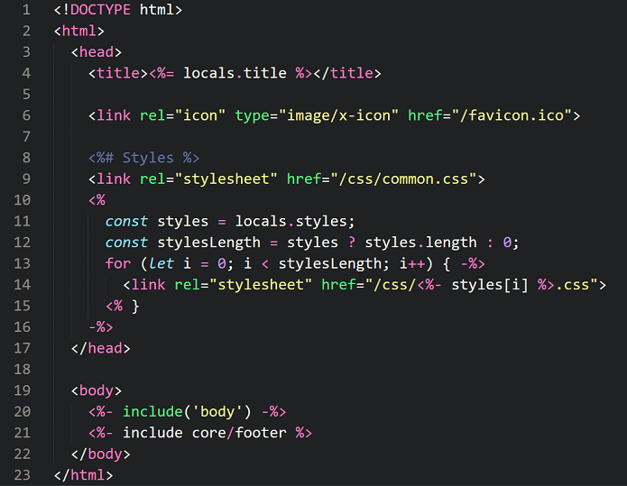

# sublime-ejs

EJS syntax definition for Sublime Text 3. Works with [EJS v2](http://ejs.co/) syntax. Also includes some snippets.

> Requires Sublime Text 3 build >=3103 as well as the [Babel](https://packagecontrol.io/packages/Babel) package

## Installation

Use [Package Control](https://packagecontrol.io/) to install [Babel](https://packagecontrol.io/packages/Babel) and [**EJS 2**](https://packagecontrol.io/packages/EJS%202).

#### Setting the default syntax

To set the default EJS syntax for a particular file extension:

1. Open a file with that extension
2. Select `View` from the menu
3. Then `Syntax` &rarr; `Open all with current extension as...` &rarr; `EJS 2` &rarr; `EJS (<delimiter>)`
4. Repeat this for each extension (i.e. `.ejs`)

If you're not using the default delimiters (`<% %>`), you'll want to use the EJS syntax that corresponds with the delimiters you use.
This package includes syntax definitions for the following additional delimiters: `<? ?>`, `<$ $>`, `<@ @>`.

#### Color Scheme

`EJS 2` comes with the `Dracula EJS` color scheme, which is a modified version of [zertosh/dracula-theme](https://github.com/zertosh/dracula-theme/tree/dark). You can select it from: `Preferences` &rarr; `Color Scheme` &rarr; `EJS 2`.

[`Oceanic Next`](https://github.com/voronianski/oceanic-next-color-scheme) is also a good color scheme for EJS that works right out of the box.

If you'd prefer to use a different color scheme, you may need to add lines like [these](https://github.com/nwoltman/sublime-ejs/blob/master/Dracula%20EJS.YAML-tmTheme#L228-241) to make the highlighting more compatible with EJS.

#### Example (with *Dracula EJS*)



#### Snippets

In the HTML scope:

+ `<%`+`TAB` - Inserts EJS open/close tags
+ `if`+`TAB` - Inserts EJS `if` statement
+ `for`+`TAB` - Inserts EJS `for` loop

### Shortcomings

##### Babel Requirement

The default Sublime JavaScript syntax definition does not have very good support for code that uses ES6+ syntax and the Sublime syntax definition language does not allow you to use an alternate syntax definition if the chosen one does not exist, so Babel will remain a requirement until one of those things changes.

##### Highlighting Hiccup

Currently, this syntax definition cannot recognize when an EJS closing tag (i.e. `%>`) is part of a JavaScript string or regex, so it will end the JavaScript section and return to highlighting HTML even though it shouldn't.

Example:

```js
<%
const str = 'These are EJS delimiters: <% %>';
// Now right here is HTML because of this ^^
%>
```

However, you can get around this without changing the meaning of your JavaScript code by adding a backslash (`\`) before the closing `>` like so:

```js
const str = 'These are EJS delimiters: <% %\>';
// Everything is fine here
```

## Contributing

Most problems are best addressed by opening an [issue](https://github.com/nwoltman/sublime-ejs/issues).
<!-- Also, check out the [contributing guide](https://github.com/nwoltman/sublime-ejs/blob/master/CONTRIBUTING.md). -->
